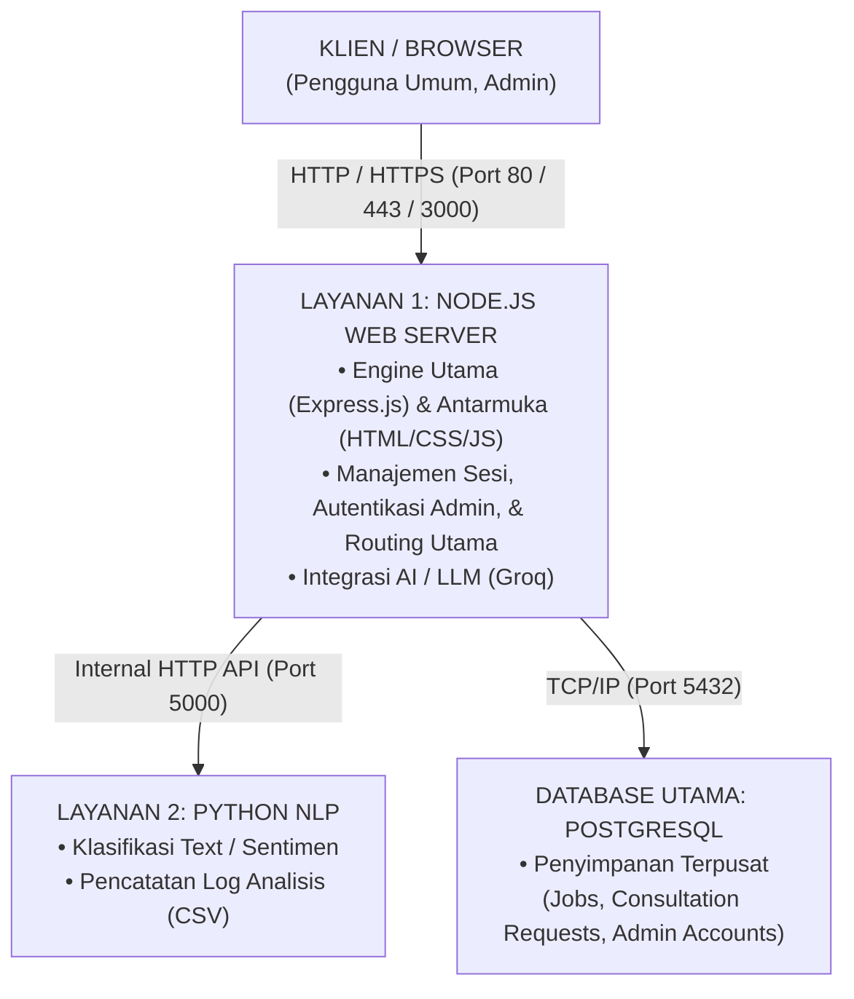

# Panduan Instalasi Sagara Revamp (V2)

Berikut adalah kerangka dan panduan instalasi lengkap untuk Sagara Revamp versi terbaru (arsitektur Microservices dengan Docker). Panduan ini disusun agar mudah dimasukkan ke dalam buku atau dokumen serah terima proyek Anda.

---

## Bab X: Panduan Instalasi dan Konfigurasi Sistem

### 1. Kebutuhan Sistem (Prasyarat)
Sebelum melakukan instalasi, pastikan lingkungan server atau komputer lokal Anda telah memenuhi spesifikasi berikut:
*   **Sistem Operasi**: Ubuntu 20.04 / 22.04 LTS (Direkomendasikan untuk Production) atau Windows/macOS/Linux (Untuk Development).
*   **Docker Engine & Docker Compose**: Sistem di-deploy menggunakan containerization untuk menjaga keseragaman environment.
*   **Node.js**: Versi `>=18.0.0` (Hanya jika Anda ingin menjalankan skrip utilitas tanpa Docker).
*   **Git**: Untuk proses kloning (cloning) kode sumber dari repositori.

### 2. Arsitektur Layanan Sagara Revamp
Sagara Revamp versi saat ini mengadopsi pola arsitektur *microservices* ringan yang terdiri dari 3 kontainer utama:
1.  **Sagara Backend (Node.js)**: Bertindak sebagai server utama (berjalan di port 3000), menangani API, antarmuka pengguna (public UI), dashboard admin, serta integrasi AI dengan Groq API.
2.  **Sagara NLP Service (Python)**: Layanan pemrosesan bahasa natural atau *Natural Language Processing* yang berjalan secara independen (berjalan di port 5000).
3.  **Sagara Database (PostgreSQL 15)**: Relational Database Management System untuk penyimpanan kredensial admin, histori, biometrik, dsb. (berjalan di port 5432).

**Diagram Arsitektur Sistem Saat Ini:**



---

### 3. Instalasi Lingkungan Pengembangan (Local / Development)

Bagi pengembang yang ingin menjalankan Sagara di komputer lokal, ikuti langkah berikut:

**Langkah 1: Kloning Repositori**
Buka terminal dan jalankan perintah:
```bash
git clone <URL_REPOSITORY_SAGARA>
cd sagara_revamp
```

**Langkah 2: Konfigurasi Environment (`.env`)**
Buat file konfigurasi environment berdasarkan file contoh yang disediakan:
```bash
cp .env.example .env
```
Buka file `.env` dan isi variabel penting, antara lain:
*   `GROQ_API_KEY`: API key dari platform Groq untuk engine AI.
*   Konfigurasi Database (Jika perlu disesuaikan).
*   Data Admin (Misal: `ADMIN_1_USER` dan `ADMIN_1_PASS` dalam format *bcrypt*).

**Langkah 3: Menjalankan Sistem dengan Docker**
Jalankan semua service sekaligus menggunakan Docker Compose standar:
```bash
docker compose up -d --build
```
Sistem akan mengunduh dependencies (Node modules & Python requirements) serta melakukan inisialisasi *database*.

**Langkah 4: Manajemen Skrip Database (Opsional)**
Jika Anda mengembangkan fitur dan membutuhkan sinkronisasi database manual, jalankan melalui terminal:
```bash
npm install # Install package lokal
npm run db:check     # Mengecek koneksi database
npm run db:migrate   # Menjalankan migrasi tabel
npm run db:sync      # Sinkronisasi skema
```

---

### 4. Deployment Lingkungan Produksi (VPS Production)

Buku panduan harus mencakup bagaimana sistem ini dinaikkan ke internet untuk pengguna akhir:

**Langkah 1: Persiapan Server VPS**
Masuk ke VPS via SSH, pastikan Docker sudah terinstal. Jika belum:
```bash
curl -fsSL https://get.docker.com -o get-docker.sh
sudo sh get-docker.sh
```

**Langkah 2: Kloning & Setup `.env`**
Lakukan prosedur yang sama dengan *Development*, yaitu kloning repo dan buat file `.env` di server. Pastikan kata sandi admin diubah demi keamanan.

**Langkah 3: Menjalankan Konfigurasi Produksi**
Sagara Revamp memiliki file konfigurasi khusus produksi (`docker-compose.prod.yml`) di mana Node.js akan di-binding langsung ke **Port 80** agar bisa diakses lewat browser tanpa menuliskan nomor port.
```bash
docker compose -f docker-compose.prod.yml up -d --build
```

**Langkah 4: Pengujian**
*   **Halaman Utama Publik**: `http://<ALAMAT_IP_VPS>/`
*   **Dashboard Admin**: `http://<ALAMAT_IP_VPS>/admin/login`

---

### 5. Manajemen dan Pemeliharaan (Maintenance)

Bagian penting di buku dokumentasi untuk Administrator Sistem.

*   **Melihat Status Kontainer:**
    ```bash
    docker compose -f docker-compose.prod.yml ps
    ```
*   **Melihat Log Server (Error & Traffic) secara real-time:**
    ```bash
    docker compose -f docker-compose.prod.yml logs -f
    ```
*   **Mematikan Sistem:**
    ```bash
    docker compose -f docker-compose.prod.yml down
    ```
*   **Melakukan Update Versi (Pull Code Terbaru):**
    ```bash
    git pull origin main
    docker compose -f docker-compose.prod.yml up -d --build
    ```
*   **Meringankan Storage Server (Pembersihan Image/Kontainer tak terpakai):**
    ```bash
    docker system prune -f
    ```

---

### 📋 Daftar Pengecekan Tambahan untuk Buku Anda:
Selain panduan instalasi di atas, pastikan buku Anda mencakup:
1.  **Daftar Endpoint API**: Dokumentasikan endpoint utama yang digunakan oleh *frontend* (misal: `/api/chat`, `/admin/login`, dsb).
2.  **Struktur Database**: ERD (Entity Relationship Diagram) atau daftar tabel yang dihasilkan dari migrasi PostgreSQL Sagara (bisa didapat menggunakan `npm run db:tables`).
3.  **Panduan Penggunaan Admin**: Cara kerja dashboard, cara login menggunakan credentials yang diset di `.env`, dan panduan fitur biometrik (jika ada, melihat `npm run db:biometrics`).
4.  **Penjelasan Integrasi AI**: Cara sistem terhubung ke *Groq API* untuk menghasilkan respons cerdas dan peran NLP Service (Python) pada pemrosesan bahasanya.
