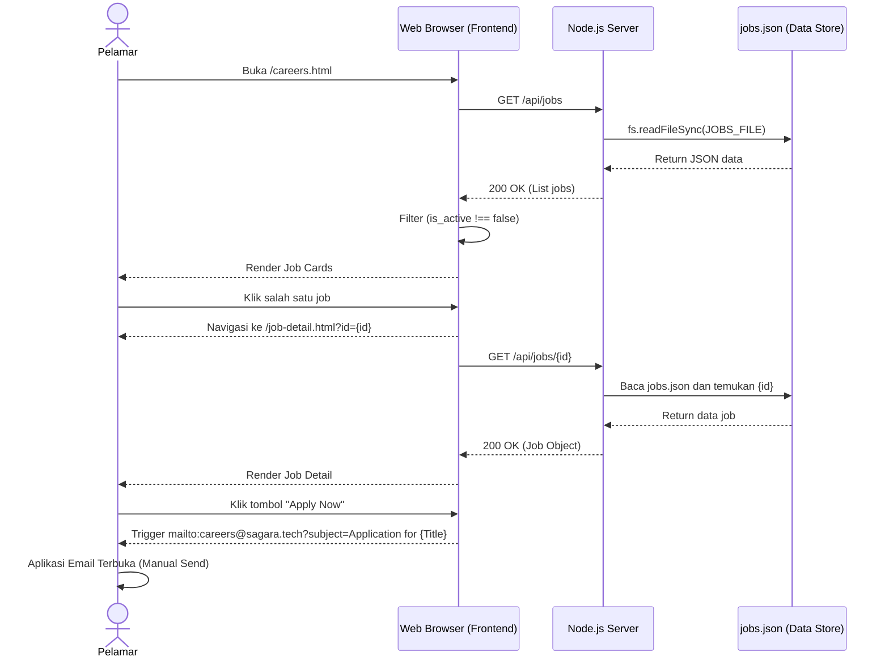

# Dokumentasi Job Portal (Public-Facing) - Sagara Revamp

Dokumen ini melengkapi F400 dan F1-F5 dengan mendokumentasikan spesifikasi, alur, dan arsitektur dari sisi publik Job Portal (untuk pelamar kerja), yang mana tidak tercakup dalam dokumen desain awal.

---

## 1. Kode Backend Endpoint Publik

Backend Node.js (`server.js`) menyediakan dua endpoint utama untuk Job Portal publik. Data lowongan dibaca secara statis dari `data/jobs.json`.

### a. GET `/api/jobs`
Digunakan untuk mengambil seluruh daftar lowongan pekerjaan.
```javascript
// server.js (Baris 652-659)
app.get('/api/jobs', (req, res) => {
    try {
        const jobs = JSON.parse(fs.readFileSync(JOBS_FILE));
        res.json(jobs);
    } catch (err) {
        res.json([]);
    }
});
```

### b. GET `/api/jobs/:id`
Digunakan untuk mengambil detail spesifik dari satu lowongan pekerjaan berdasarkan ID.
```javascript
// server.js (Baris 661-669)
app.get('/api/jobs/:id', (req, res) => {
    try {
        const jobs = JSON.parse(fs.readFileSync(JOBS_FILE));
        const job = jobs.find(j => j.id == req.params.id);
        res.json(job || null);
    } catch (err) {
        res.status(500).json({ error: 'Failed to load job' });
    }
});
```

---

## 2. Kode Frontend Job Portal

### a. Komponen Halaman Daftar Job (`public/careers.html` & `public/js/careers.js`)
File `careers.js` melakukan `fetch` ke endpoint `/api/jobs`. Proses yang terjadi di frontend:
1. Membaca preferensi bahasa dari `localStorage`.
2. Melakukan filter: **hanya** menampilkan lowongan yang berstatus aktif (`job.is_active !== false`).
3. Menerjemahkan *job type* dan *experience* secara dinamis ke Bahasa Indonesia jika diperlukan.
4. Me-render HTML berbentuk kartu (Card) dan menyuntikkannya ke elemen dengan ID `jobsGrid`.
5. Kartu memiliki event `onclick` yang mengarahkan user ke `/job-detail.html?id=${job.id}`.

### b. Komponen Halaman Detail Job (`public/job-detail.html`)
Di dalam file ini, skrip bekerja dengan cara:
1. Mengekstrak ID dari URL (`new URLSearchParams(window.location.search).get('id')`).
2. Melakukan fetch ke `/api/jobs/${jobId}`.
3. Menampilkan informasi detail pekerjaan seperti title, deskripsi, requirements (jika tidak ada akan diberikan nilai default), dan benefit (what we offer).

---

## 3. Flow Aplikasi / Lamar Kerja (Apply Flow)

Saat ini, mekanisme melamar tidak menyimpan data ke database server dan tidak menggunakan form di dalam aplikasi. Alur (flow) nya diarahkan via protokol *mailto*.

1. **User membuka halaman Careers** (`/careers.html`).
2. **User menelusuri daftar lowongan** yang saat ini sedang aktif (is_active: true).
3. **User melihat detail lowongan** dengan mengklik salah satu card lowongan, lalu diarahkan ke `/job-detail.html?id=xxx`.
4. **User mengklik tombol "Apply Now"**.
5. **Redireksi ke Aplikasi Email Klien** (Outlook/Gmail/Mail App bawaan), karena tombol Apply di hardcode menggunakan link: 
   `<a href="mailto:careers@sagara.tech?subject=Application for ${job.title}">`

---

## 4. DFD (Data Flow Diagram) Level 2/3 Khusus Job Portal Publik

Karena F300 hanya membuat DFD untuk Consultation, berikut adalah DFD Level 2 untuk bagian Job Portal Publik:

**Proses 1.0: Request Daftar Lowongan Aktif**
- Entitas Eksternal: **Pelamar (User)**
- Data Flow Masuk: Permintaan halaman Careers
- Proses: 1.1 Fetch List (/api/jobs), 1.2 Filter Active Jobs
- Data Store: **D1 Jobs Data (`jobs.json`)**
- Data Flow Keluar: JSON array jobs dikirim ke Pelamar

**Proses 2.0: Request Detail Lowongan**
- Entitas Eksternal: **Pelamar (User)**
- Data Flow Masuk: Klik detail job (mengirim parameter `id`)
- Proses: 2.1 Fetch Job by ID (/api/jobs/:id)
- Data Store: **D1 Jobs Data (`jobs.json`)**
- Data Flow Keluar: Detail informasi job spesifik

**Proses 3.0: Melamar Lowongan (Apply)**
- Entitas Eksternal: **Pelamar (User)**
- Data Flow Masuk: Klik tombol Apply
- Proses: 3.1 Trigger Mailto Action (Membuka aplikasi email User dengan subjek otomatis)
- Entitas Eksternal (Penerima): **HR Sagara Tech (Email: careers@sagara.tech)**

---

## 5. Sequence Diagram: Alur Browsing & Apply Job



---

## 6. Testing Evidence Khusus Job Portal Publik

### a. Pengujian `GET /api/jobs` (Postman / Browser)
- **URL**: `http://localhost:3000/api/jobs`
- **Expected Status**: 200 OK
- **Expected Response (Mock)**:
```json
[
  {
    "id": 1,
    "title": "Frontend Developer",
    "location": "Jakarta, Indonesia",
    "type": "Full-time",
    "experience": "Min. 2 years",
    "salary": "Competitive",
    "description": "We are looking for a skilled Frontend Developer...",
    "is_active": true
  },
  {
    "id": 2,
    "title": "Backend Developer",
    "location": "Remote",
    "type": "Full-time",
    "is_active": false
  }
]
```

### b. Pengujian `GET /api/jobs/:id` (Postman / Browser)
- **URL**: `http://localhost:3000/api/jobs/1`
- **Expected Status**: 200 OK
- **Expected Response (Mock)**:
```json
{
  "id": 1,
  "title": "Frontend Developer",
  "location": "Jakarta, Indonesia",
  "type": "Full-time",
  "experience": "Min. 2 years",
  "salary": "Competitive",
  "description": "We are looking for a skilled Frontend Developer...",
  "requirements": [
    "React.js experience",
    "Tailwind CSS mastery"
  ],
  "is_active": true
}
```

### c. Pengujian Validasi Frontend
- **Skenario**: Buka `/careers.html`.
- **Hasil**: Frontend hanya menampilkan card untuk "Frontend Developer" (karena "Backend Developer" memiliki `is_active: false`).

---
*Dokumen ini dibuat untuk melengkapi celah (missing gap) dari desain sistem sebelumnya terkait fungsionalitas Job Portal publik.*
